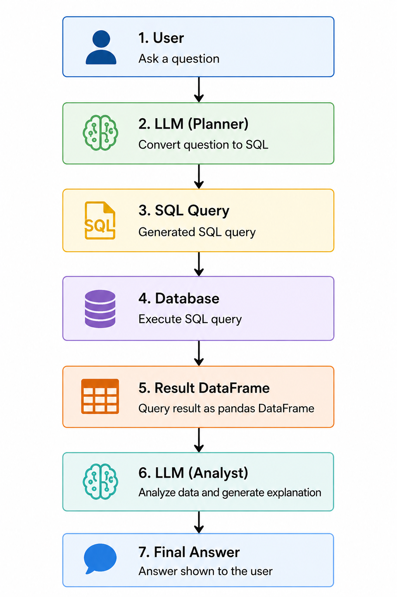
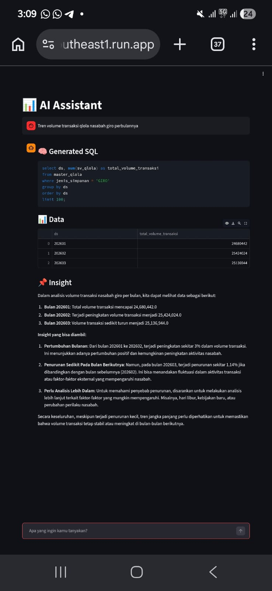

# poc-rag-qlola
This is a Proof of Concept of an RAG-based augmented analytics.
The goal is simple: to help business users to analyze QLola performance easier by creating a gpt-style chatbot.

Flow: 
 
 
Result: 

This PoC uses:
- OpenAI gpt-4o-mini
- Supabase to store postgresql dummy data
- Streamlit
- Google Cloud Run 
- No vectorDB (yet), all the rules can be stored in prompt so far
